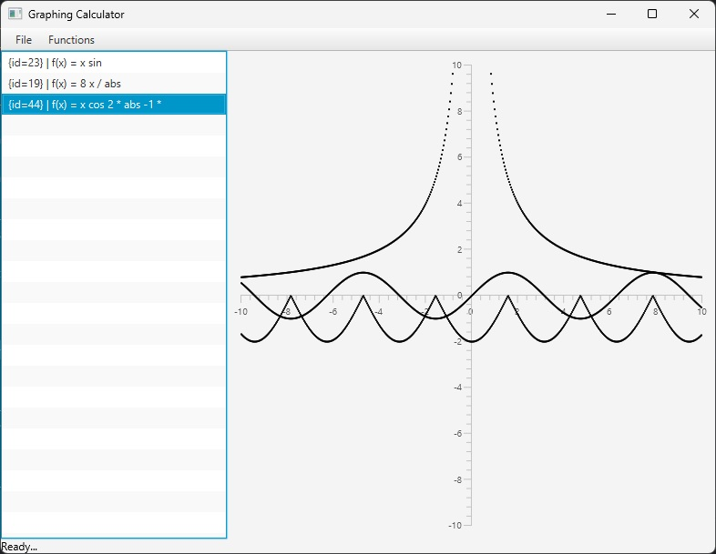
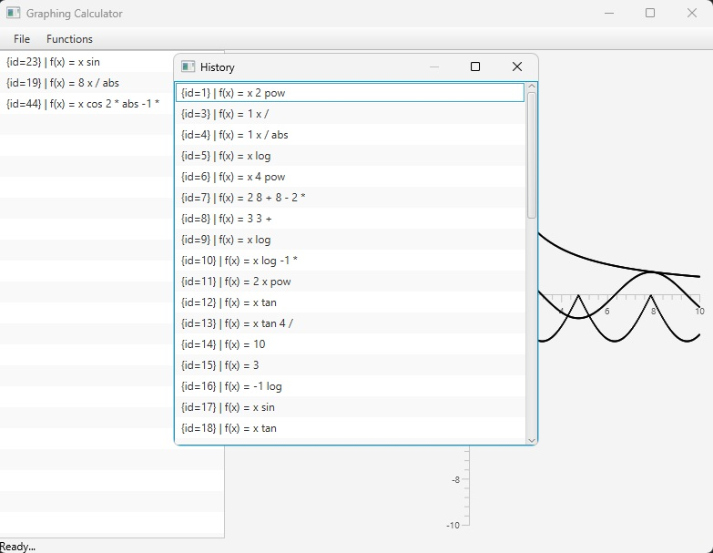
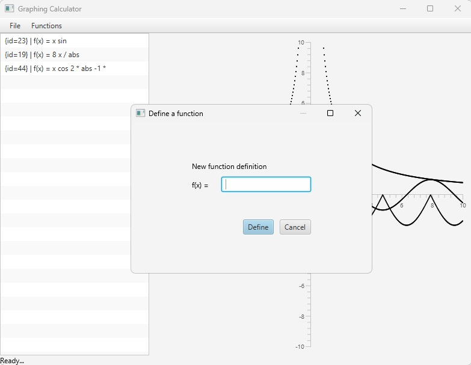

# Graphing Calculator (2024)

A 2D graphing calculator built with **Java** and **JavaFX**.

> **Note**: This is an archived project from 2024.

---

## Screenshots

  
  
  

---

## Features

* **Interactive 2D Graphing:** Custom dynamic canvas with automatic axes scaling and scroll-wheel zoom support (needs refinement).
* **Expression Evaluation:** Mathematical expressions evaluated using **Reverse Polish Notation (RPN)**, with support for both variable and constant functions.
* **Function History & Persistence:** Saves user-defined functions across sessions using an embedded **Apache Derby** database.
* **XML Export:** Export function definitions and history directly to XML format.
* **FXML:** UI built with FXML layouts.

---

## Built With

* **Language:** Java
* **GUI Framework:** JavaFX (FXML)
* **Database:** Apache Derby (Java DB / JDBC)

---

## Acknowledgments

* **README Generation**: This README was generated by Google Gemini based on the project's source code.
* **Manual Refinement**: The generated README was checked and polished by the author.